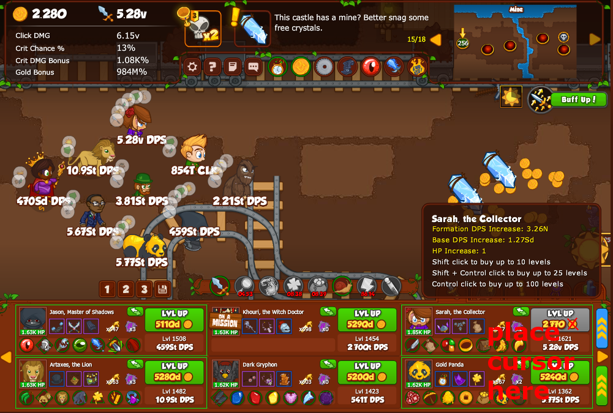
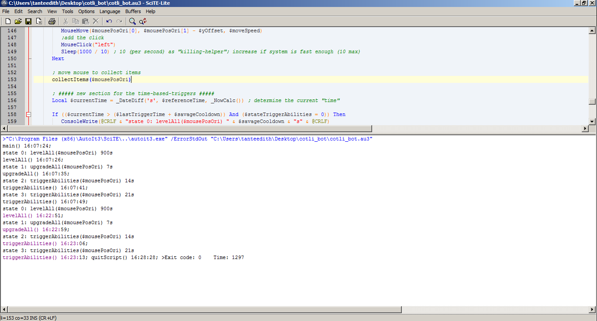

# cotli_bot - A bot for 'Crusaders of the Lost idols'

## Quick instructions for the bot usage

### How to use (quick instructions) - verified with Cotli 0.71
	
0. download the repository 
1. open the au3-file in AutoIt and execute it (press F5) 
2. open Cotli in your favorite browser (Chrome suggested because of needed Flash-performance) 
3. position the cursor over the center of the "level up"-coin for your favorite DPS-char (for now it has to be in the top right; check screenshot) 
4. press "Shift + y" for start 
5. press "Shift + x" if you want to pause it for a while - continue with the same hotkey! Repositioning the cursor not needed. 
6. stop with "F5" 

### How the game-area should look like before starting:

Don't scale/zoom your screen! - else edit the coordinates in the script.

### Example output in the output-area of the AutoIt-editor (ScITE):

